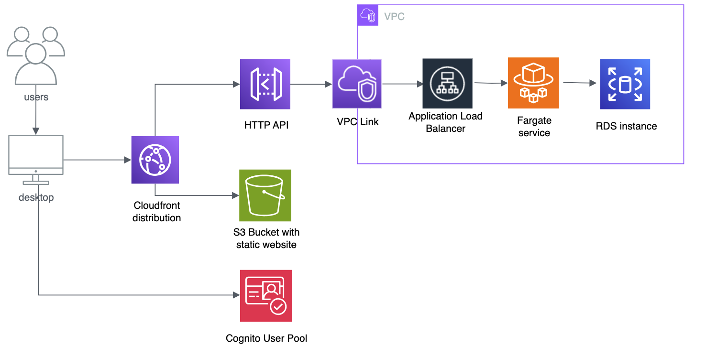
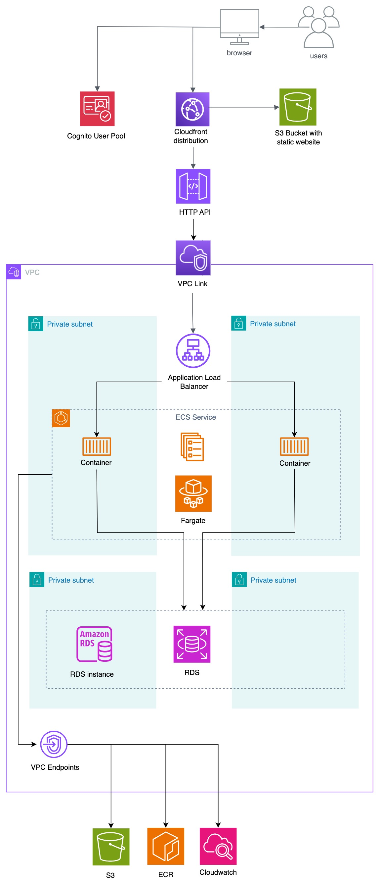

# Serverless Architecture for a Web Application in AWS
This repository contains the Terraform configuration files to deploy a serverless architecture on AWS, along with the source code for a web application that interacts with a Cognito user pool for the authentication of users. The deployment of the infrastructure and the web application is automated using Github Actions.

## Architecture Overview

Here is a high-level overview of the architecture and the core services used:



A more detailed diagram of the architecture is shown below:



Users connect to the website hosted in an S3 bucket and served through a CloudFront distribution. To access the website's components, users must first authenticate. The page retrieves the authentication token from an Amazon Cognito user pool and uses it to sign subsequent requests from the browser.

An HTTP API, hosted in API Gateway, validates the token included in the request headers before allowing access to the Application Load Balancer (ALB) via a VPC Link. The ALB then routes the request to an ECS service running on AWS Fargate, where a containerized application processes it.

The containers interact with a database instance managed by Amazon RDS within private subnets to handle business data. Additionally, the ECS service accesses other AWS services through VPC Endpoints, enabling it to pull images from Amazon ECR and store logs in Amazon CloudWatch log groups.

The Terraform configuration files in the `infrastructure/app-infrastructure` directory of this repository are used to deploy the architecture on AWS.

## Web Application

The frontend of the web application is built using Angular 17. The frontend [uses the Amplify library](app-code/frontend/src/app/auth/login/login.component.ts) to [interact with Amazon Cognito](app-code/frontend/src/app/app.config.ts), and [a functional interceptor](app-code/frontend/src/app/interceptors/auth.interceptor.ts) to add an Authorization header in the requests made to the backend. The source code of the frontend is located in the [`app-code/frontend`](app-code/frontend) directory.

For the Spring Boot backend, database connection parameters are provided via environment variables defined in [the ECS task definition](infrastructure/app-infrastructure/ecs.tf). These automatically override [the values used for local development in the source code](app-code/backend/src/main/resources/application.properties), eliminating the need for any manual modifications to the backend code. The source code of the backend is located in the [`app-code/backend`](app-code/backend) directory.

The database is a PostgreSQL database hosted in Amazon RDS. The SQL script for the database creation is defined in the [`app-code/database/init.sql`](app-code/database/init.sql) file, and the data is loaded from CSV files in the [`app-code/database/data`](app-code/database/data) directory.

## Deployment

This guide will walk you through setting up and deploying the full stack application using Terraform and GitHub Actions.

---

### Prerequisites
1. **AWS Account**: Ensure you have an AWS account with necessary permissions.
2. **AWS CloudShell**: Preferably run the code snippets of this guide in [AWS CloudShell](https://aws.amazon.com/cloudshell/).
3. **GitHub Repository Access**: You must have admin access to the GitHub repository.
4. **Terraform Installation**: AWS CloudShell doesn't come with Terraform pre-installed. Install it by running:
   ```sh
   sudo yum install -y yum-utils
   sudo yum-config-manager --add-repo https://rpm.releases.hashicorp.com/AmazonLinux/hashicorp.repo
   sudo yum -y install terraform
   ```

---

### Step 1: Fork the Repository

You must fork the repository to run the deployment workflows:
1. Navigate to the original repository on GitHub
2. Click the "Fork" button in the top-right corner
3. Select your account as the destination

> **Important**: Forking is required (not just cloning) because the deployment workflows need access to repository secrets that you'll configure in later steps. These secrets can only be set and accessed in a repository you own.

Now, clone the forked repository:

```sh
git clone https://github.com/[organization]/[repository-name].git
cd [repository-name]
```

### Step 2: Create the OIDC Role

To allow GitHub Actions to interact with AWS, you must create an **OIDC role**. Run the following script inside the `scripts/` folder:

```sh
cd scripts
chmod +x aws-github-oidc-setup.sh
./aws-github-oidc-setup.sh
```

* Follow the interactive prompts to enter the **Role name** (remember this for the Step 4) and **GitHub repository name**.
* After exiting the interactive menu, run `cd -` to return to the root directory of the repository.

### Step 3: Deploy the Terraform Remote Backend

The **remote backend** stores the Terraform state file securely in AWS. Run the following commands:

```sh
cd infrastructure/state-backend
terraform init
terraform apply
```

* This will create an **S3 bucket** and a **DynamoDB table** for Terraform state management.
* Copy the names of the **S3 bucket** and **DynamoDB table**, as you will need them in the next step.
* Run `cd -` to return to the root directory of the repository.

### Step 4: Set Up GitHub Repository Secrets

In your **GitHub repository**, navigate to:
* **Settings** → **Secrets and variables** → **Actions** → **New repository secret**

Add the following secrets:

Secret Name | Value (Example)
----------- | --------------
`AWS_ACCOUNT_ID` | 123456789012
`AWS_ROLE_TO_ASSUME_NAME` | {Your_OIDC_Role_Name}
`DB_NAME` | app_db
`DB_USERNAME` | admin
`DB_PASSWORD` | **(See password policy below)**
`TERRAFORM_LOCK_TABLE` | {Your_DynamoDB_Table_Name}
`TERRAFORM_STATE_BUCKET` | {Your_S3_Bucket_Name}

**AWS RDS Password Policy**
* Minimum **8 characters**
* Must include **uppercase**, **lowercase**, **number**, and **special character** (`!@#$%^&*()`)

You can generate a compliant password using:

```sh
openssl rand -base64 12 | tr -d '/+=' | cut -c1-7 | sed 's/[A-Za-z]/\U&/1; s/[A-Za-z]/\L&/2; s/[0-9]/&!/1; s/[0-9]/1&/2;' | awk '{print $0 substr("!@#$%^&*()", int(rand()*10)+1, 1)}'
```

### Step 5: Deploy the Full Stack Application

Trigger the **"Deploy Full Stack Application to AWS"** workflow:
1. Go to **GitHub Actions** tab.
2. Select **"Deploy Full Stack Application to AWS"** workflow.
3. Click **"Run workflow"**.

This will:
* Provision infrastructure in AWS using Terraform.
* Deploy the application code.

### Step 6: (Optional) Destroy Application Resources

If you need to **destroy the application infrastructure** (excluding the remote backend):
1. Go to **GitHub Actions** tab.
2. Select **"Destroy Terraform Resources"** workflow.
3. Click **"Run workflow"**.

### Step 7: (Optional) Clean Up OIDC Role

To remove the **OIDC role and associated IAM resources**, run:

```sh
cd scripts
./aws-github-oidc-setup.sh
```

* Select the **cleanup** option when prompted.
* Run `cd -` to return to the root directory of the repository.

### Notes

* **The remote backend is not deleted automatically** to prevent accidental loss of Terraform state.
* To remove the remote backend, manually run:

```sh
cd infrastructure/state-backend
terraform destroy
```

* To completely reset the repository setup, repeat all steps from **Step 1**.
